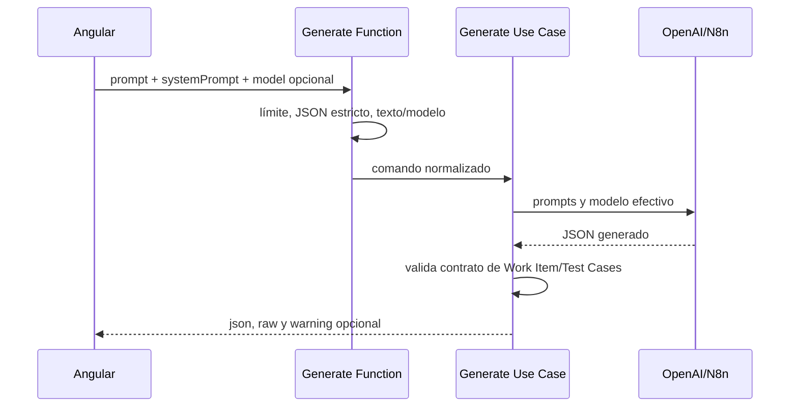
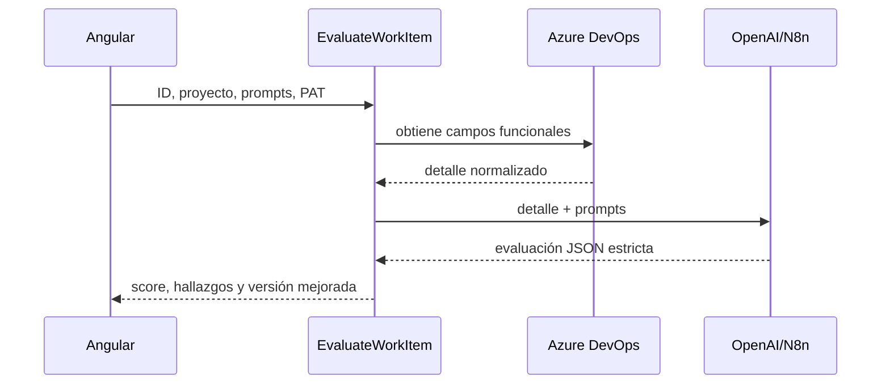
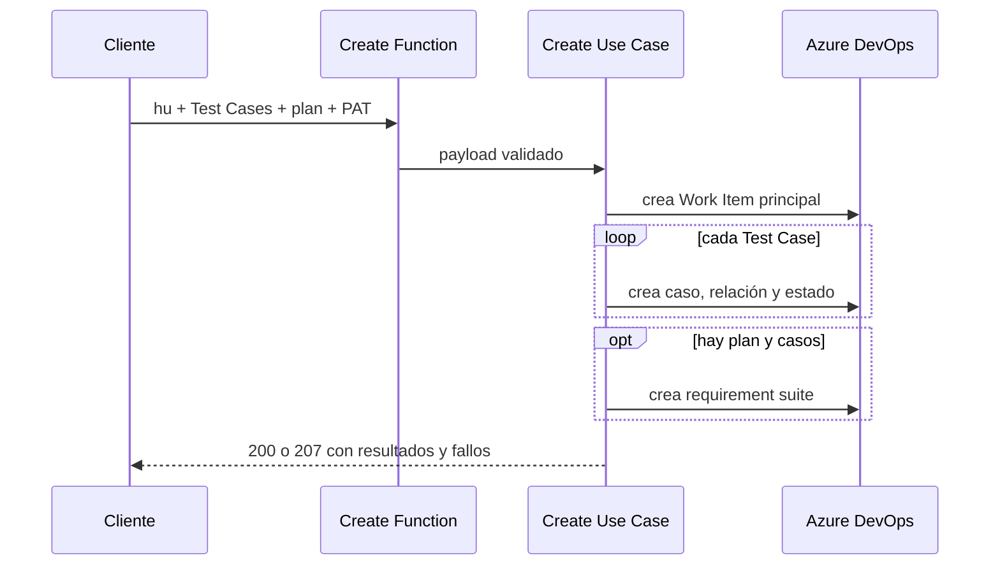
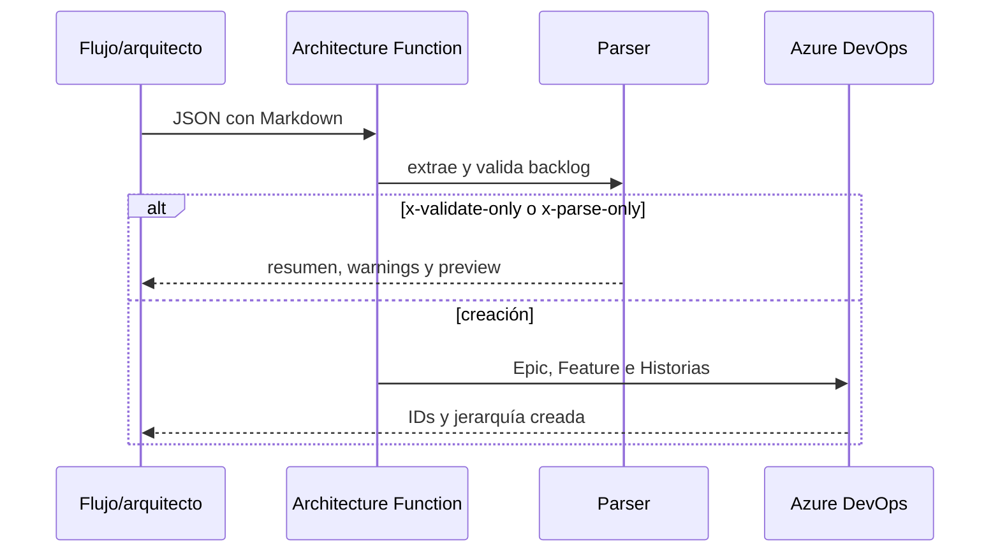
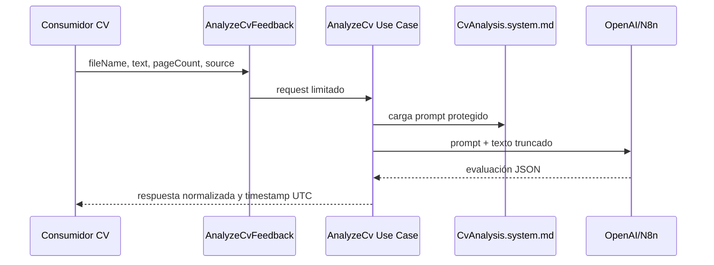

# Flujos de solicitud

## Generación

```mermaid
sequenceDiagram
    participant UI as Angular
    participant F as Generate Function
    participant UC as Generate Use Case
    participant AI as OpenAI/N8n
    UI->>F: prompt + systemPrompt + model opcional
    F->>F: límite, JSON estricto, texto/modelo
    F->>UC: comando normalizado
    UC->>AI: prompts y modelo efectivo
    AI-->>UC: JSON generado
    UC->>UC: valida contrato de Work Item/Test Cases
    UC-->>UI: json, raw y warning opcional
```

## Evaluación

```mermaid
sequenceDiagram
    participant UI as Angular
    participant F as EvaluateWorkItem
    participant AZ as Azure DevOps
    participant AI as OpenAI/N8n
    UI->>F: ID, proyecto, prompts, PAT
    F->>AZ: obtiene campos funcionales
    AZ-->>F: detalle normalizado
    F->>AI: detalle + prompts
    AI-->>F: evaluación JSON estricta
    F-->>UI: score, hallazgos y versión mejorada
```

## Creación

```mermaid
sequenceDiagram
    participant C as Cliente
    participant F as Create Function
    participant UC as Create Use Case
    participant AZ as Azure DevOps
    C->>F: hu + Test Cases + plan + PAT
    F->>UC: payload validado
    UC->>AZ: crea Work Item principal
    loop cada Test Case
        UC->>AZ: crea caso, relación y estado
    end
    opt hay plan y casos
        UC->>AZ: crea requirement suite
    end
    UC-->>C: 200 o 207 con resultados y fallos
```

## Integración de arquitectura

```mermaid
sequenceDiagram
    participant C as Flujo/arquitecto
    participant F as Architecture Function
    participant P as Parser
    participant AZ as Azure DevOps
    C->>F: JSON con Markdown
    F->>P: extrae y valida backlog
    alt x-validate-only o x-parse-only
        P-->>C: resumen, warnings y preview
    else creación
        F->>AZ: Epic, Feature e Historias
        AZ-->>C: IDs y jerarquía creada
    end
```

## Análisis de CV

```mermaid
sequenceDiagram
    participant C as Consumidor CV
    participant F as AnalyzeCvFeedback
    participant UC as AnalyzeCv Use Case
    participant P as CvAnalysis.system.md
    participant AI as OpenAI/N8n
    C->>F: fileName, text, pageCount, source
    F->>UC: request limitado
    UC->>P: carga prompt protegido
    UC->>AI: prompt + texto truncado
    AI-->>UC: evaluación JSON
    UC-->>C: respuesta normalizada y timestamp UTC
```

